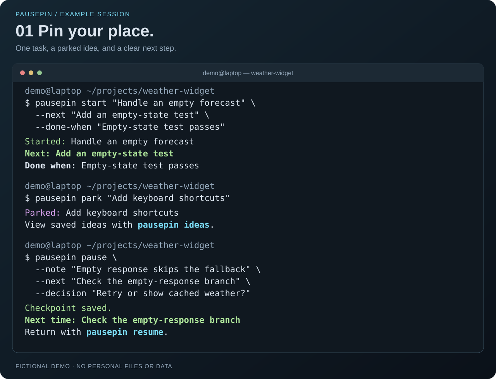
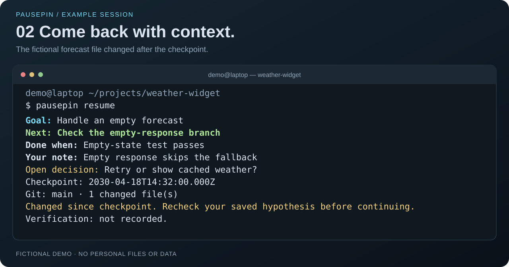
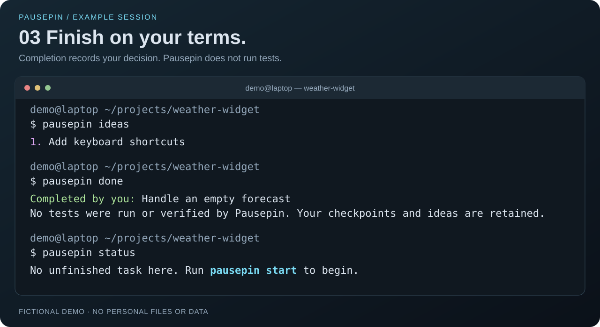

# Pausepin

Pin your place. Pick up where you left off.

Pausepin is a local CLI that keeps your goal, next action, and stopping point together. Park an idea, save a return note, and resume with a check for changes in your Git working tree.

The design is ADHD-informed: one active task, one visible next action, and a place for tangents. It is an experimental developer tool, with no claim of clinical benefit. You do not need an AI account to use it.

## See it in action

A fictional developer working on a weather widget: start with one next action, park a tangent, and leave a checkpoint for later. These terminal illustrations use real CLI output from an isolated demo—not anyone's personal computer, files, or saved tasks.



On return, the next action is highlighted. Saved notes and an open decision restore context; a Git warning signals that the project changed after the checkpoint.



Parked ideas remain available after finishing. Marking a task done records your decision—it does not run tests or verify success.



[Read the full text transcript](docs/images/demo-transcript.txt) · [How these fictional examples are made](docs/images/README.md)

## Get started

Requires Node.js 24 or later and npm. Git is optional.

Clone the repository and install from source:

```sh
git clone https://github.com/tylerdobson/pausepin.git
cd pausepin
npm ci
npm run build
npm link
```

Then open the project you want to work on:

```sh
pausepin start "Fix mobile navigation" \
  --next "Reproduce the close-button failure" \
  --done-when "Keyboard interaction and mobile checks pass"

pausepin park "Try a simpler header layout"

pausepin pause \
  --note "The overlay might intercept the close button" \
  --next "Inspect the overlay's pointer events" \
  --decision "Should tapping outside the menu close it?"

pausepin resume
```

On return, Pausepin shows your saved context and checks whether the repository has changed since the checkpoint. Your note is a hypothesis you recorded; it is not a verified test result. Pausepin does not run tests or infer that the task is complete.

This project is not published to the npm registry yet. Install from source using the commands above.

## Commands

| Command | Purpose |
| --- | --- |
| `pausepin start "goal" --next "action" --done-when "criterion"` | Start a task with a concrete next action and finish condition. |
| `pausepin park "idea"` | Save a tangent for later. |
| `pausepin pause [--note "note"] [--next "action"] [--decision "decision"]` | Save a checkpoint and optional return context. |
| `pausepin resume` | Reactivate the current task, recover its context, and check for repository changes. |
| `pausepin status` | See the current task and repository changes without changing task status. |
| `pausepin ideas` | Read parked ideas. |
| `pausepin done` | Mark the task complete yourself. |
| `pausepin export` | Write the project's recorded context as JSON to standard output. |

Use `--json` for machine-readable output, `--help` for usage, and `--version` for the installed version.

`start` and `pause` save checkpoints. Omitting a `pause` option keeps its previous value. Use `--note ''` or `--decision ''` to clear that field; `--next` must always contain an action. You can park ideas even when no task is active.

One task can be unfinished in each project. Finish it with `pausepin done` before starting another. Completion records your decision; it does not certify that your finish condition passed.

In a Git repository, commands use its canonical root directory, so you can run them from subdirectories. Outside Git, the current canonical directory identifies the project. Repository drift checks are available only when Git is available and the directory is a Git repository.

## Terminal colors

Pausepin uses cyan for goals and help headings, green for next actions and success, yellow for warnings and open decisions, magenta for parked ideas, and red for errors. The next action is also bold. Body text keeps your terminal's normal foreground color.

Colors turn on automatically in a TTY when `TERM` is not `dumb`. Set `NO_COLOR` to disable all styling, `FORCE_COLOR=1` to enable colors in pipes, or `FORCE_COLOR=0` to disable colors. `NO_COLOR` takes precedence whenever it is present. `--json` and `pausepin export` always produce plain JSON.

## Local data

Pausepin uses SQLite and keeps its database outside your project:

- Default: `~/.local/share/pausepin/pausepin.sqlite`
- With an absolute `XDG_DATA_HOME`: `$XDG_DATA_HOME/pausepin/pausepin.sqlite`
- With `PAUSEPIN_HOME`: `$PAUSEPIN_HOME/pausepin.sqlite`

`PAUSEPIN_HOME` selects the data directory and takes precedence over `XDG_DATA_HOME`. The database filename is always `pausepin.sqlite`. Use an override for an isolated demo or development store. Choose a directory outside the project so database writes do not change the project's Git fingerprint. A relative `XDG_DATA_HOME` is ignored in favor of the default location.

There is no telemetry, account, or cloud sync. Pausepin records your notes and Git fingerprints, not copies of your source files. It does not commit, switch branches, or edit your project files. Exported JSON contains your recorded project context, including private notes; review it before sharing.

Git fingerprints cover tracked files and nonignored untracked files. Tracked files remain included even when they match an ignore rule. Ignored untracked files and state outside the repository are excluded. Snapshotting fails explicitly above 64 MiB per file, 512 MiB of total content, or 100,000 paths, including initialized submodules. A snapshot is not atomic across Git metadata and all files; capture it when other tools have finished changing the repository.

See [checkpoint documentation](docs/checkpoint-format.md) for the distinction between saved context and observed repository state.

## Develop

```sh
npm ci
npm run check
npm test
npm run build
```

The implementation uses TypeScript and Node's built-in SQLite support, with zero runtime dependencies. Read [CONTRIBUTING.md](CONTRIBUTING.md) before making a change.

## What comes next

First, make daily use of these commands dependable. Then explore import support, a shared checkpoint format, and one coding-agent integration. Agent summaries should preserve the difference between a suggestion, a human note, and verified evidence.

Useful early feedback: How long did it take to make your first useful change after returning? What did the return note get wrong? How much work did keeping the note require?

MIT licensed. See [LICENSE](LICENSE).
